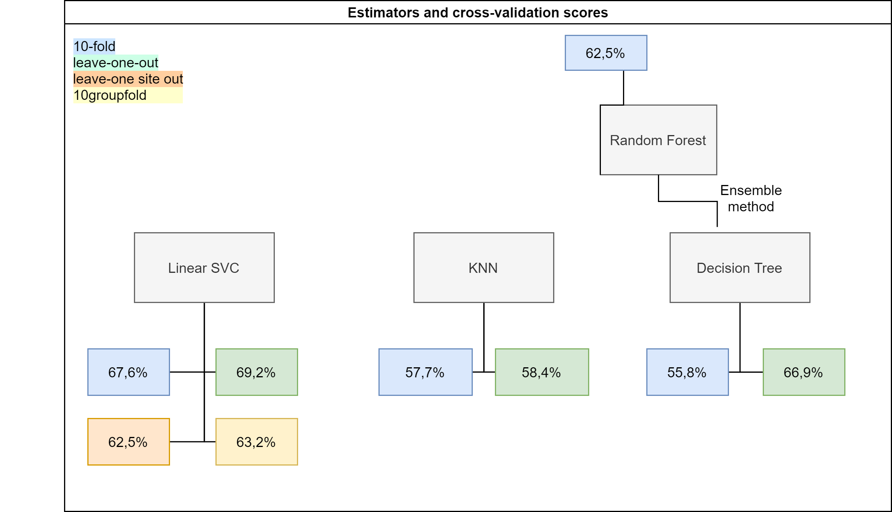

# How well can autism be predicted from fMRI data?

By Andréanne Proulx

*Source: https://researchfeatures.com/2016/06/20/decoding-language-brain/

### Background

I am a Master's student in Psychology currently enrolled at the University of Montreal. My main focus is in genomic imagery which consists of relating information about genetics to fonctional and structural brain phenotypes. More specifically, I have been interested in functional connectivity measures in the resting-state in carrier populations. 

## Project definition 

This project's main objective will be to learn how to use machine learning and visualisation tools available in Python. As for the scientific purpose, it will be to evaluate the performance of different linear and non-linear classification algorithms (SVM, decision tree, random forest, etc.) at a task which consists of predicting autism diagnosis from the functional connectivity profile observed in subjects. I will also try out cross validation and different hyperparameters in order to maximise the classification performance.    

https://hal.inria.fr/hal-01824205v3/document

A second objective for this project will be to integrate as much of the tools (Github notably) we were introduced to in the previous week allowing therefore science to be as reproducible as possible. 

### Tools 

This project will rely on the following tools: 
 * Jupyter Notebook 
 * Libraries: Scikit-learn, Nilearn, Seaborn, Matplotlib, Pyplot
 * Github 

### Data 
For the purpose of this project, I will be using an the preprocessed open source database ABIDE (see Preprocessed Connectomes Project), available through Nilearn. This data contains structural, functional and phenotypic data of 539 individuals with autism and 573 typical controls.  

### Deliverables
 - A jupyter notebook containing the code and all visualisation graphs
 - Requirements.txt
 - Readme file 
 - Python script
 - Presentation slides
 - Interactive plot (Week 3)
 
### Tools I will learn during this project
 - Matplotlib & Plotly: Explore different ways of exploring and plotting the data
 - Nilearn: Visualize fMRI data in the form of static and interactive images (matrix, brain plotting, etc.)
 - Sklearn: Dimensionality reduction, test-train split, try out different estimator to fit the data, cross-validation methods, evaluate performance
 - Github

## Open to colabs?
Part of the ABIDE TEAM. See team repo: https://github.com/orgs/brainhack-school2020/teams/abide-team

### Deliverable week 3
 - link: [Age distribution](https://anproulx.github.io/publication_website/)
 - link: [Influence of hyperparameter values gamma and C for SVM estimator](https://anproulx.github.io/cross_validation_plots/)

### Results

##### Other projects
## Conclusion and acknowledgement

